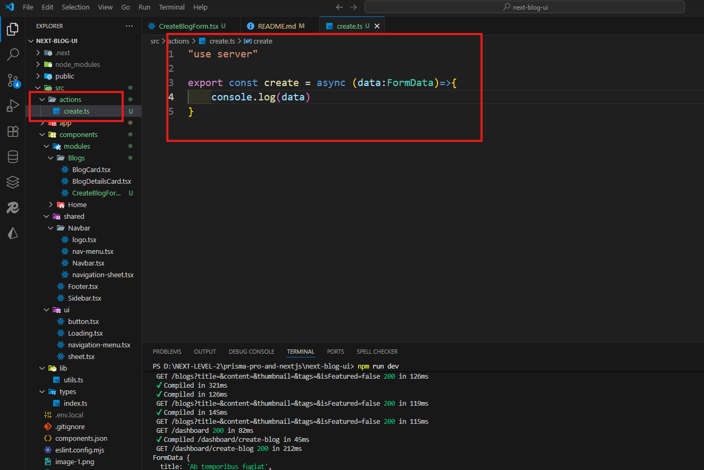

# Next.js Blog Project

## Setup

Clone the repository, install dependencies, and start the dev server

Server GitHub Repo Link:

https://github.com/Apollo-Level2-Web-Dev/next-blog-server


Frontend GitHub Repo Link:

https://github.com/Apollo-Level2-Web-Dev/next-blog-ui

## 53-1 Initial project setup and configure external server

- change .env.example to .env
- clone server part-2

- frontend run port 3000
- Backend run port 5000
- download postMan api and drag and drop to postman

## 53-2 Caching and revalidating the latest blogs on the homepage
For the frontend, I use a .env.local file.
If you want different environment variables for development and production, create separate files:

- Development: .env.local (or .env.development)

- Production: .env.production

When you build your project, the production build automatically uses the variables from .env.production, so the browser receives the production API.
 - set env  NEXT_PUBLIC_ must use in next js
 ```ts
 NEXT_PUBLIC_BASE_API=http://localhost:5000/api/v1
 ```
 - add this for image 
 ```ts
 import type { NextConfig } from "next";

const nextConfig: NextConfig = {
  /* config options here */
    images: {
    remotePatterns: [
      {
        protocol: 'https',
        hostname: '**',
    
      },
    ],
  },
};

export default nextConfig;

```
 #### data fetching (public) page.tsx 
 ```ts
 /* eslint-disable @typescript-eslint/no-explicit-any */
import BlogCard from "@/components/modules/Blogs/BlogCard";
import Hero from "@/components/modules/Home/Hero";

export default async function HomePage() {
  const res = await fetch(`${process.env.NEXT_PUBLIC_BASE_API}/post`);
  const {data:blogs} = await res.json();
 console.log(blogs)
  return (
    <div>
      <Hero />
      <h2 className="text-center my-5 text-4xl">Featured Posts</h2>
      <div className=" grid grid-cols-3 gap-8 text-4xl my-8">
        {
          blogs.map((blog:any)=>(
              <BlogCard key={blog?.id} post={blog}   />
          ))
        }
      </div>
    </div>
  );
}

```
- BlogCard 
```ts
/* eslint-disable @typescript-eslint/no-explicit-any */
import Link from "next/link";
import Image from "next/image";

export default function BlogCard({ post }: { post: any }) {
  console.log(post)
  return (
    <Link
      href={`/blogs/${post.id}`}
      className="block group transform hover:-translate-y-1 transition-transform duration-300"
    >
      <div className="bg-white dark:bg-gray-900 rounded-2xl overflow-hidden shadow-md hover:shadow-xl transition-shadow duration-300">
        {post.thumbnail ? (
          <div className="relative h-56 w-full overflow-hidden">
            <Image
              src={post.thumbnail}
              alt={post.title}
              fill
              className="object-cover group-hover:scale-105 transition-transform duration-300"
            />
          </div>
        ) : (
          <div className="h-56 w-full bg-gray-200 dark:bg-gray-700 flex items-center justify-center text-gray-500 dark:text-gray-300">
            No Image
          </div>
        )}

        <div className="p-6">
          <h3 className="text-xl font-bold mb-2 group-hover:text-blue-600 transition-colors">
            {post.title}
          </h3>

          <p className="text-gray-700 dark:text-gray-300 mb-4 line-clamp-3">
            {post.content}
          </p>

          <div className="flex items-center justify-between mb-4">
            <div className="flex items-center gap-2">
              <Image
                src={
                  post.author.picture ||
                  "https://cdn-icons-png.flaticon.com/512/9385/9385289.png"
                }
                alt={post.author.name}
                width={36}
                height={36}
                className="rounded-full border-2 border-gray-200 dark:border-gray-700"
              />
              <span className="text-gray-600 dark:text-gray-300 text-sm flex items-center gap-1">
                {post.author.name}
                {post.author.isVerified && (
                  <svg
                    xmlns="http://www.w3.org/2000/svg"
                    className="h-4 w-4 text-blue-500"
                    fill="none"
                    viewBox="0 0 24 24"
                    stroke="currentColor"
                  >
                    <path
                      strokeLinecap="round"
                      strokeLinejoin="round"
                      strokeWidth={3}
                      d="M5 13l4 4L19 7"
                    />
                  </svg>
                )}
              </span>
            </div>
            <span className="text-gray-500 dark:text-gray-400 text-sm">
              {post.views} views
            </span>
          </div>

          <div className="text-right">
            <span className="text-blue-600 dark:text-blue-400 font-semibold text-sm hover:underline">
              Read More →
            </span>
          </div>
        </div>
      </div>
    </Link>
  );
}
```

## 53-3 Show off all the fantastic blogs using SSR
- use ISR method after every  30 second ha re rendering the full page and show the update content
- you update the any content in your data after 30 seconds show it
- and this method only work in fetched data not full website
```ts
/* eslint-disable @typescript-eslint/no-explicit-any */
import BlogCard from "@/components/modules/Blogs/BlogCard";
import Hero from "@/components/modules/Home/Hero";

export default async function HomePage() {
  const res = await fetch(`${process.env.NEXT_PUBLIC_BASE_API}/post`,{
    next:{
      revalidate:30
    }
  });
  const {data:blogs} = await res.json();
 console.log(blogs)
  return (
    <div>
      <Hero />
      <h2 className="text-center my-5 text-4xl">Featured Posts abc</h2>
      <div className=" grid grid-cols-3 gap-8 max-w-6xl text-4xl my-8 mx-auto">
        {
          blogs.slice(0,3).map((blog:any)=>(
              <BlogCard key={blog?.id} post={blog}   />
          ))
        }
      </div>
    </div>
  );
}
```
- SSR implement in allBlogs page
- when user request then data fetching in server side then give the data thats need some loading but instant send update data
```ts
import BlogCard from "@/components/modules/Blogs/BlogCard";
import { IBlogPost } from "@/types";

const AllBlogsPage = async () => {
  const res = await fetch(`${process.env.NEXT_PUBLIC_BASE_API}/post`,{
    cache:"no-store"
  });
  const {data:blogs} = await res.json()

  return (
    <div className="py-30 px-4 max-w-7xl mx-auto">
      <h2 className="text-center text-4xl">All Blogs page </h2>
<div className="grid grid-cols-3 gap-4 my-4">
{
  blogs.map((blog:IBlogPost)=>(
<BlogCard key={blog.id} post={blog}/>

  ))
}
</div>
    </div>
  );
};

export default AllBlogsPage;
```
## 53-4 Retrieve dynamic data with an ID for the detail page using SSR
- first create dynamic folder then fetch data dynamically
- dynamic data by default server side rendering

```ts
import BlogDetailsCard from '@/components/modules/Blogs/BlogDetailsCard';
import React from 'react';

const BlogDetailsPage =async ({params}:
    {params:Promise<{blogId:string}>}) => {
    const {blogId} = await params

  const res = await fetch(`${process.env.NEXT_PUBLIC_BASE_API}/post/${blogId}`);
  const blog = await res.json()


    return (
        <div className='max-w-7xl mx-auto py-30 px-4'>
          <BlogDetailsCard blog={blog}/>
        </div>
    );
};

export default BlogDetailsPage;
```

## 53-5 Fetch dynamic data using generateStaticParams() for SSG
- In Next.js 13+, when you have dynamic routes like /blogs/[blogId], and you want SSG (Static Site Generation), Next.js needs to know at build time which pages to pre-render.

- generateStaticParams() is the function that tells Next.js all the dynamic route parameters you want to pre-build.

- It returns an array of objects, each object containing the route parameters.
```ts
import BlogDetailsCard from "@/components/modules/Blogs/BlogDetailsCard";
import { IBlogPost } from "@/types";
import React from "react";

export const generateStaticParams = async () => {
  const res = await fetch(`${process.env.NEXT_PUBLIC_BASE_API}/post`);
  const { data: blogs } = await res.json();

  return blogs.slice(0,2).map((blog:IBlogPost)=>({
blogId:String(blog.id)
  }))
};

const BlogDetailsPage = async ({
  params,
}: {
  params: Promise<{ blogId: string }>;
}) => {
  const { blogId } = await params;

  const res = await fetch(`${process.env.NEXT_PUBLIC_BASE_API}/post/${blogId}`);
  const blog = await res.json();

  return (
    <div className="max-w-7xl mx-auto py-30 px-4">
      <BlogDetailsCard blog={blog} />
    </div>
  );
};

export default BlogDetailsPage;
```

## 53-6 Generating Dynamic Metadata with generateMetadata()
- build seo
- use normally metadata function
```ts
import BlogCard from "@/components/modules/Blogs/BlogCard";
import { IBlogPost } from "@/types";
import { Metadata } from "next";


export const metadata:Metadata = {
  title:"All Blogs Page",
  description:"Brows All blog Post on web development",

}

const AllBlogsPage = async () => {
  const res = await fetch(`${process.env.NEXT_PUBLIC_BASE_API}/post`,{
    cache:"no-store"
  });
  const {data:blogs} = await res.json()

  return (
    <div className="py-30 px-4 max-w-7xl mx-auto">
      <h2 className="text-center text-4xl">All Blogs page </h2>
<div className="grid grid-cols-3 gap-4 my-4">
{
  blogs.map((blog:IBlogPost)=>(
<BlogCard key={blog.id} post={blog}/>

  ))
}
</div>
    </div>
  );
};

export default AllBlogsPage;

```
- use normally metadata function
```ts
import BlogDetailsCard from "@/components/modules/Blogs/BlogDetailsCard";
import { IBlogPost } from "@/types";
import React from "react";

export const generateStaticParams = async () => {
  const res = await fetch(`${process.env.NEXT_PUBLIC_BASE_API}/post`);
  const { data: blogs } = await res.json();
  return blogs.slice(0,2).map((blog:IBlogPost)=>({
blogId:String(blog.id)
  }))
};


// dynamic metadata
export const generateMetadata=async ({
  params,
}: {
  params: Promise<{ blogId: string }>;
}) => {
  const { blogId } = await params;

  const res = await fetch(`${process.env.NEXT_PUBLIC_BASE_API}/post/${blogId}`);
  const blog = await res.json()
return {
    title:blog?.title,
    description:blog?.content
}
}

const BlogDetailsPage = async ({
  params,
}: {
  params: Promise<{ blogId: string }>;
}) => {
  const { blogId } = await params;

  const res = await fetch(`${process.env.NEXT_PUBLIC_BASE_API}/post/${blogId}`);
  const blog = await res.json();

  return (
    <div className="max-w-7xl mx-auto py-30 px-4">
      <BlogDetailsCard blog={blog} />
    </div>
  );
};

export default BlogDetailsPage;

```

## 53-7 Creating Blogs Using Next.js Form Component
#### what is server action 
A Server Action in Next.js (App Router) is an async function that runs only on the server.
It never gets sent to the client, so any sensitive data (like secret keys) stays completely hidden.
```ts
"use client";

import { create } from "@/actions/create";
import Form from "next/form";

import { useState } from "react";

export default function CreateBlogForm() {
  const [isFeatured, setIsFeatured] = useState("false");

  return (
    <Form
      action={create}
      className="max-w-4xl mx-auto p-6 bg-white shadow-md rounded-lg space-y-4 w-full"
    >
      <h2 className="text-xl font-semibold mb-4">Create Blog</h2>

      {/* Title */}
      <div>
        <label className="block text-sm font-medium mb-1" htmlFor="title">
          Title
        </label>
        <input
          type="text"
          id="title"
          name="title"
          className="w-full rounded-md border px-3 py-2 focus:ring focus:ring-blue-200"
        />
      </div>

      {/* Content */}
      <div>
        <label className="block text-sm font-medium mb-1" htmlFor="content">
          Content
        </label>
        <textarea
          id="content"
          name="content"
          rows={4}
          className="w-full rounded-md border px-3 py-2 focus:ring focus:ring-blue-200"
        />
      </div>

      {/* Thumbnail */}
      <div>
        <label className="block text-sm font-medium mb-1" htmlFor="thumbnail">
          Thumbnail URL
        </label>
        <input
          type="url"
          id="thumbnail"
          name="thumbnail"
          className="w-full rounded-md border px-3 py-2 focus:ring focus:ring-blue-200"
        />
      </div>

      {/* Tags */}
      <div>
        <label className="block text-sm font-medium mb-1" htmlFor="tags">
          Tags (comma separated)
        </label>
        <input
          type="text"
          id="tags"
          name="tags"
          placeholder="Next.js, React, Web Development"
          className="w-full rounded-md border px-3 py-2 focus:ring focus:ring-blue-200"
        />
      </div>

      {/* Featured */}
      <div>
        <p className="block text-sm font-medium mb-1">Featured</p>
        <div className="flex gap-6">
          <label className="flex items-center gap-2">
            <input
              type="radio"
              name="isFeatured"
              value="true"
              checked={isFeatured === "true"}
              onChange={(e) => setIsFeatured(e.target.value)}
              className="text-blue-600 focus:ring-blue-500"
            />
            Yes
          </label>
          <label className="flex items-center gap-2">
            <input
              type="radio"
              name="isFeatured"
              value="false"
              checked={isFeatured === "false"}
              onChange={(e) => setIsFeatured(e.target.value)}
              className="text-blue-600 focus:ring-blue-500"
            />
            No
          </label>
        </div>
      </div>

      <button
        type="submit"
        className="w-full bg-blue-600 text-white font-medium py-2 rounded-md hover:bg-blue-700 transition"
      >
        Submit
      </button>
    </Form>
  );
}
```
- create a action folder


## 53-8 Creating Blogs Using Next.js Server Actions